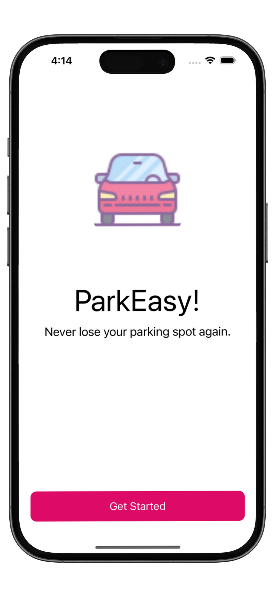
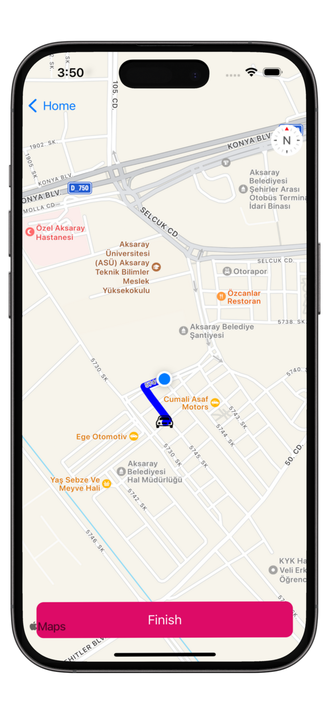
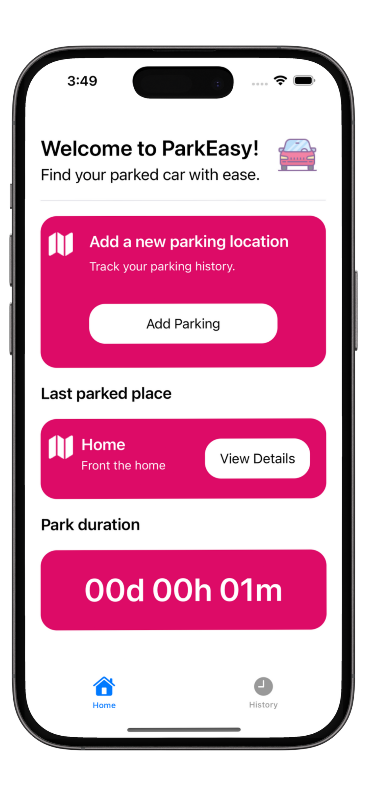

# ParkEasy

The mobile application is ParkEasy eliminates the problem of forgetting parking in big cities. You can also record the location of where you parked your car safely during your travels. It offers a solution to your forgetting problem.

The app is made entirely in UIKit and uses Core Data to save parking spaces. MKMapView was used for the map.

**`Dependencies:`** 

Firebase

Snapkit

GoogleMobileAds

SwipeCellKit

### Screens
<a href="https://apps.apple.com/us/app/parkeasy/id6469385516"> </img> </a>    
<a href="https://apps.apple.com/us/app/parkeasy/id6469385516"> </img> </a>    
<a href="https://apps.apple.com/us/app/parkeasy/id6469385516"> </img> </a>    
<a href="https://apps.apple.com/us/app/parkeasy/id6469385516"> </img> </a>    

